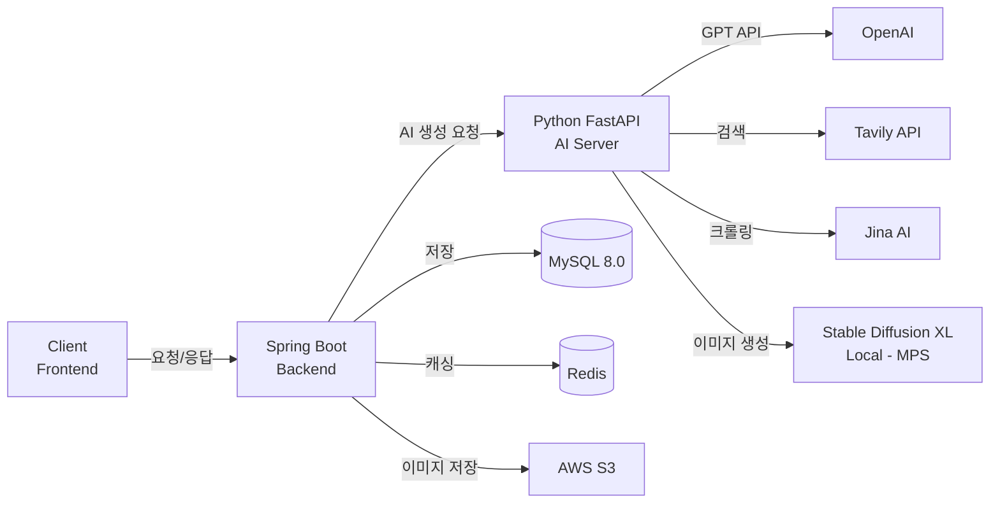

<div align="center">
  
# 👋 안녕하세요! 장지민(Jimin)입니다.

<p>
  
</p>

[](https://hits.seeyoufarm.com)

</div>

<br/>

## 🌟 About Me

```typescript
const jimin = {
  location: "Seoul, South Korea 🇰🇷",
  education: "Hanyang University ERICA",
  major: ["ICT Convergence", "Computer Science"],
  interests: ["AI/ML", "Full-Stack Development", "System Architecture"],
  currentFocus: "Building AI-powered services that create real value",
  techStack: {
    backend: ["Spring Boot", "FastAPI", "Python"],
    frontend: ["Flutter", "HTML/CSS/JS"],
    ai: ["Stable Diffusion", "OpenAI GPT", "PyTorch"],
    cloud: ["AWS S3", "Docker", "Redis"]
  },
  motto: "함께 성장하는 가치를 중요하게 생각합니다 🌱"
};
```

<br/>

## 🎓 Education

**한양대학교 ERICA** (2023.02 ~ Present)
- 📚 **ICT융합학부 & 컴퓨터학부 다중전공**
- 🏆 **3개 공모전 수상** (총장상, 학장상, 관광공사사장상)
- 💻 **4개 해커톤 참여** (메이커톤, HY-THON, HY-END 등)
- 🚀 새로운 기술을 배우고 실전에 적용하는 것을 즐깁니다

<br/>

## 💻 Tech Stack

### 🎯 Language


### 🌐 Frontend & Mobile


### ⚙️ Backend & Framework


### 🗄️ Database


### 🤖 AI / ML


### ☁️ Cloud & DevOps


### 🛠️ Tools & Environment


<br/>

## 🏆 Awards & Achievements

<table align="center" width="95%">
  <tr>
    <td align="center" width="25%">
      <br/>
      <b>🏅 우수상</b><br/>
      <sub>한양대학교 총장상</sub><br/>
      <a href="https://github.com/RAVNUS-INC/KnowMe-Frontend.git"><b>SW창업 메이커톤</b></a><br/>
      <sup>KnowMe - AI 진로&채용 맞춤 솔루션</sup>
    </td>
    <td align="center" width="25%">
      <br/>
      <b>🏅 최우수상</b><br/>
      <sub>소프트웨어융합대학장상</sub><br/>
      <a href="https://github.com/Jangjimin9766/hython-team3-front.git"><b>HY-THON</b></a><br/>
      <sup>느린우체국 - 나만의 느린 감성일기</sup>
    </td>
    <td align="center" width="25%">
      <br/>
      <b>🏅 우수상</b><br/>
      <sub>한국관광공사사장상</sub><br/>
      <a href="https://github.com/eoieiie/project-ISLAND.git"><b>관광데이터 활용 공모전</b></a><br/>
      <sup>ISLETRIP - 섬 여행 플랫폼</sup>
    </td>
    <td align="center" width="25%">
      <br/>
      <b>💻 참여</b><br/>
      <sub>HY-END 해커톤</sub><br/>
      <a href="https://github.com/Nitge/HY-END-TEAM1-PINGU.git"><b>PINGU Project</b></a><br/>
      <sup>PingU 위치기반 다이어리 플랫폼</sup>
    </td>
  </tr>
</table>

<br/>

## 🚀 Featured Projects

### 📱 M:ine - AI 기반 개인화 매거진 플랫폼
> 모든 주제를 프리미엄 매거진으로 변환하는 AI 에디터 🎨

<div align="center">

[](https://github.com/Jangjimin9766/Mine_server)
[](https://github.com/Jangjimin9766/Mine-AI)


</div>

#### 🎯 프로젝트 개요
- **기간**: 2024.09 ~ 현재 (진행 중)
- **역할**: **Full-Stack Developer** (Backend + AI Server 단독 개발)
- **설명**: 사용자가 원하는 모든 주제를 Vogue, GQ 스타일의 프리미엄 매거진으로 자동 생성하는 AI 서비스

#### 💡 핵심 성과

<table>
<tr>
<td width="50%">

**🔧 Architecture Excellence**
- ✅ **Gateway Pattern** 설계
  - Spring Boot ↔ FastAPI 완전 분리
  - Python: AI 생성만 담당 (Stateless)
  - Spring: 저장/인증/비즈니스 로직
- ✅ **비용 최적화**
  - Local Stable Diffusion XL (MPS)
  - **무제한 무료** 이미지 생성
  - 외부 API 비용 $0

</td>
<td width="50%">

**🚀 Technical Highlights**
- ✅ **Multi-Source Search**
  - Tavily (검색) + Jina AI (깊이 읽기)
  - 정확도 향상 & 최신 정보 보장
- ✅ **Chat-based Editing**
  - "첫 번째 섹션 더 감성적으로"
  - AI가 의도 분석 → 자동 재생성
- ✅ **성능 최적화**
  - N+1 쿼리 방지 (@EntityGraph)
  - Redis 캐싱, @Formula 가상 컬럼

</td>
</tr>
</table>

#### 🛠️ 기술 스택

**Backend (Spring Boot)**
```
Spring Boot 3.2.0 | Spring Security | Spring Data JPA
JWT Authentication | MySQL 8.0 | Redis | AWS S3
Swagger | Gradle | Lombok
```

**AI Server (Python FastAPI)**
```
FastAPI | OpenAI GPT-3.5-turbo | Stable Diffusion XL
Tavily Search API | Jina AI Reader | PyTorch (MPS)
Diffusers | Transformers | Hugging Face
```

#### 🏗️ 시스템 아키텍처



#### ✨ 주요 기능

| 기능 | 설명 | 기술 |
|------|------|------|
| 🎨 **AI 매거진 생성** | 모든 주제 → 프리미엄 매거진 콘텐츠 | OpenAI GPT + Tavily + Jina AI |
| 🖼️ **무드보드 생성** | 사용자 취향 기반 배경 이미지 | Stable Diffusion XL (Local) |
| 💬 **AI 채팅 편집** | 자연어로 매거진 수정 | GPT Intent Analysis |
| 🔐 **JWT 인증** | Access + Refresh Token | Spring Security |
| 👥 **소셜 기능** | 팔로우/좋아요/공유 | JPA + Redis |
| 🔗 **공유 링크** | SecureRandom 토큰 기반 | Custom Algorithm |

#### 📊 성능 & 품질

- **테스트 커버리지**: 11개 테스트 케이스 (Controller + Service)
- **보안**: BCrypt 암호화, SQL Injection 방지, CORS 설정
- **API 문서**: Swagger UI 자동 생성
- **코드 품질**: Lombok 활용, 계층 분리, DI 패턴

#### 🔍 기술적 도전 과제 해결

<details>
<summary><b>1️⃣ Gateway Pattern 설계로 책임 분리</b></summary>

**문제**: Spring에서 AI 로직까지 처리하면 코드 복잡도↑, 확장성↓  
**해결**: Python FastAPI를 별도 AI 서버로 분리  
**결과**: Spring은 비즈니스 로직, Python은 AI 생성만 담당 → 유지보수성 향상

</details>

<details>
<summary><b>2️⃣ Local Stable Diffusion으로 비용 $0 달성</b></summary>

**문제**: Stability AI API는 유료 ($0.04/장) → 비용 부담  
**해결**: Mac M4 MPS 가속으로 로컬 SDXL 실행  
**결과**: 무제한 무료 이미지 생성, FP16 최적화로 30 steps 완료

</details>

<details>
<summary><b>3️⃣ Multi-Source Search로 정확도 향상</b></summary>

**문제**: GPT만으로는 최신 정보 부족, 환각(hallucination) 발생  
**해결**: Tavily(검색) + Jina AI(깊이 읽기) 조합  
**결과**: 실시간 웹 정보 반영, 구체적이고 정확한 콘텐츠 생성

</details>

<details>
<summary><b>4️⃣ N+1 쿼리 문제 해결</b></summary>

**문제**: 매거진 조회 시 좋아요/팔로우 정보로 N+1 발생  
**해결**: @EntityGraph, Fetch Join, @Formula 활용  
**결과**: 단일 쿼리로 조회, 성능 대폭 개선

</details>

<br/>

### 🎯 Other Notable Projects

<table align="center" width="95%">
  <tr>
    <td align="center" width="33%">
      <a href="https://github.com/RAVNUS-INC/KnowMe-Frontend.git">
        
      </a><br/>
      <b>AI 기반 소개팅 매칭</b><br/>
      <sub>Flutter | Spring Boot</sub><br/>
      <sup>🏅 SW창업 메이커톤 우수상</sup>
    </td>
    <td align="center" width="33%">
      <a href="https://github.com/eoieiie/project-ISLAND.git">
        
      </a><br/>
      <b>관광 데이터 플랫폼</b><br/>
      <sub>React | Spring Boot</sub><br/>
      <sup>🏅 관광공사사장상 우수상</sup>
    </td>
    <td align="center" width="33%">
      <a href="https://github.com/Jangjimin9766/hython-team3-front.git">
        
      </a><br/>
      <b>건강 관리 서비스</b><br/>
      <sub>Flutter | Node.js</sub><br/>
      <sup>🏅 HY-THON 최우수상</sup>
    </td>
  </tr>
</table>

<br/>

## 📊 GitHub Stats

<div align="center">
  
  
</div>

<div align="center">
  
</div>

<br/>

## 💼 Experience & Skills

### 🎓 Academic Projects
- **M:ine** - AI 매거진 플랫폼 (Spring Boot + FastAPI + Stable Diffusion)
- **KnowMe** - AI 소개팅 매칭 서비스 (Flutter + Spring Boot)
- **ISLAND** - 관광 데이터 활용 플랫폼 (React + Spring Boot)

### 💪 Core Competencies
- **Full-Stack Development**: Spring Boot, FastAPI, Flutter
- **AI/ML Integration**: OpenAI GPT, Stable Diffusion, PyTorch
- **System Architecture**: Gateway Pattern, Microservices, API Design
- **Database Optimization**: JPA, Query Optimization, Redis Caching
- **Cloud & DevOps**: AWS S3, Docker, GitHub Actions

<br/>

## 🌱 Currently Learning & Future Goals

<table>
<tr>
<td width="50%">

**📚 Learning**
- Operating System (OS) internals
- Kubernetes & Container Orchestration
- CI/CD Pipeline Automation
- System Design & Scalability

</td>
<td width="50%">

**🎯 Goals for 2025**
- M:ine 서비스 정식 런칭
- 오픈소스 컨트리뷰션
- AWS Certified Solutions Architect
- 백엔드 대용량 트래픽 처리 경험

</td>
</tr>
</table>

<br/>

## 📫 Contact Me

<div align="center">
  
[](mailto:jangjimin9766@gmail.com)
[](https://github.com/jangjimin9766)
[](#)

**Email**: jangjimin9766@gmail.com  
**Location**: Seoul, South Korea 🇰🇷

</div>

<br/>

<div align="center">
  
### 💡 "새로운 기술을 배우고, 함께 성장하며, 가치있는 서비스를 만듭니다"

---


</div>
